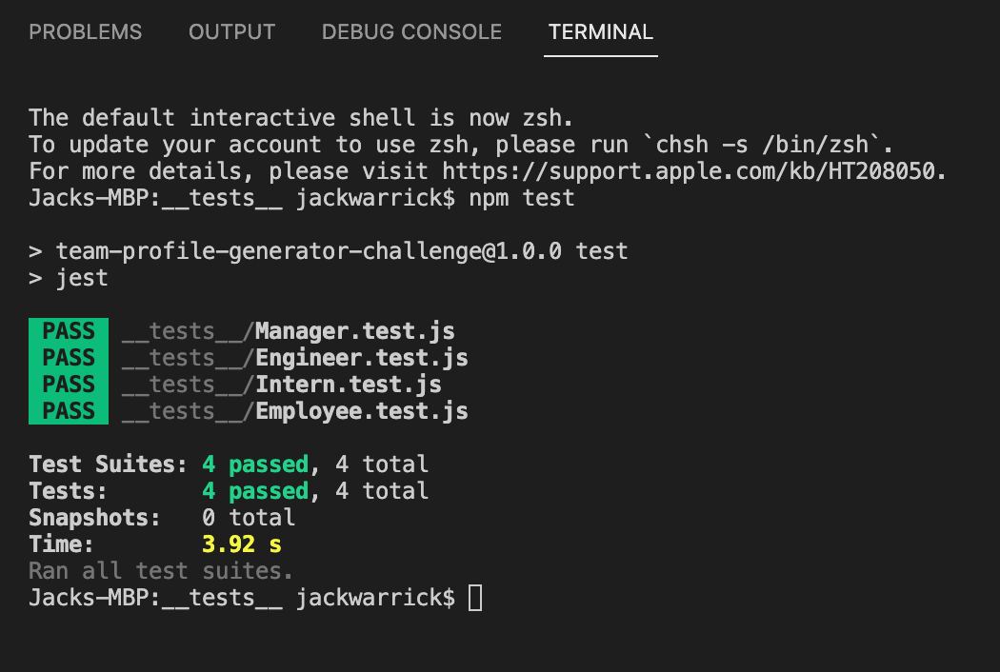
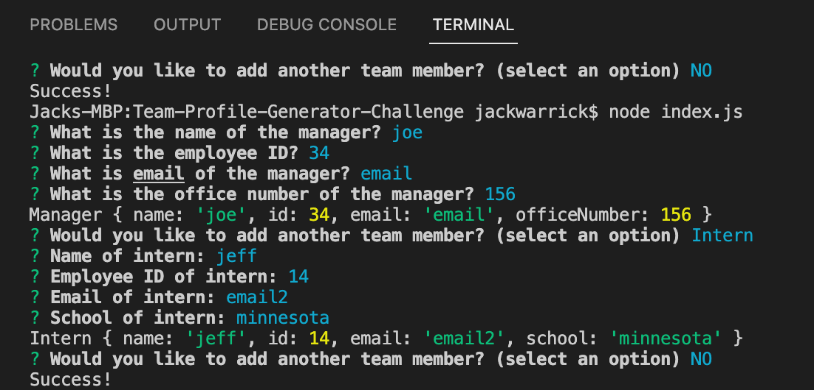
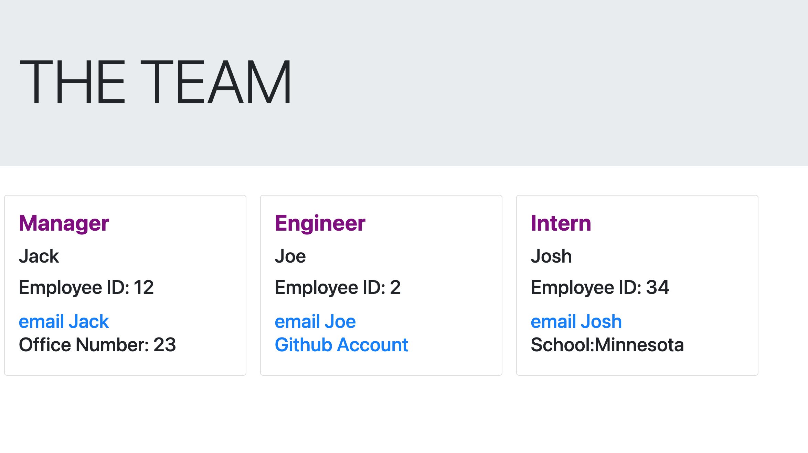

# Title: Team Profile Generator 

## Table of Contents

* [Description](#description)

* [Installation](#installation)

* [Contributing](#contributing)

* [License](#license)

* [Media](#media)

* [Questions](#questions)

## Description

This program is a command-line application that accepts user input with prompts for entering team member information. After the prompts are answered, an html file is created. The application prompts the manager information first before entering other information depending on whether the user wants to create an intern team member card or an engineer team member card. The user can keep making engineer or intern cards until selecting NO for no more team members. Different prompts exist for each role - manager, engineer and intern. When the user ends the program, an index.html file is created that presents cleanly organized cards for each employee with the information that was entered. When the user clicks on the email "name" link, the user is redirected to email that employee. When the engineer's GitHub link is clicked, the GitHub profile is opened in a new browser window.

## Installation

To install, open the application in the integrated terminal, and run node index.js. To run the tests, open the __tests__ folder in the integrated terminal and run the command "npm test" in the command line.

## Contributing

Jack Warrick

## License

This application is covered under the MIT License.

## Media

[Link to Demonstration Video](https://drive.google.com/file/d/1MrCzhoNn5B3lb608oR-SYdcMc6JljWWH/view)

-----

**Screenshot of test success:**

-----

**Screenshot of employee info in console:**

-----

**Screenshot of created page:**

-----

## Questions

For more information, please reference my GitHub profile [here](https://github.com/JackWarrick), or reach out to my email: j.d.warrick@comcast.net.

